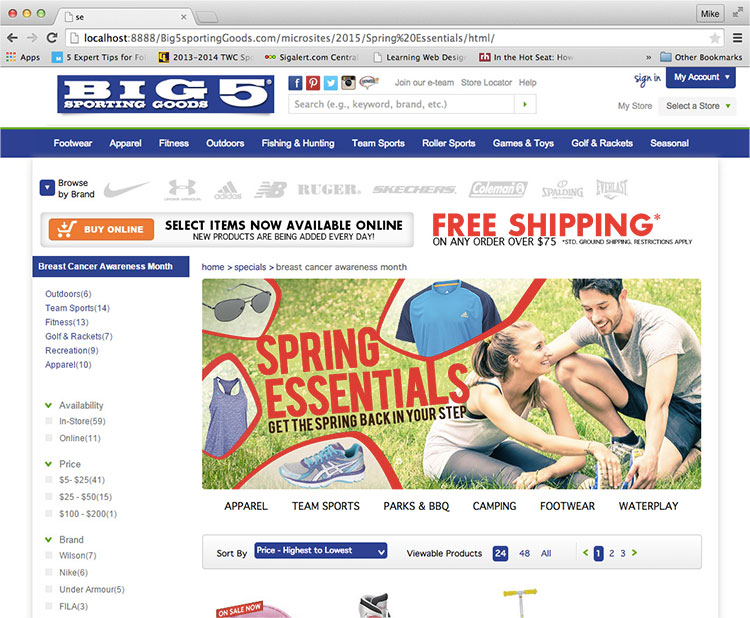

  
`big5sportinggoods.com`  

# Dates:  
2015  
# Technologies:  
HTML5, CSS3 with animation  
# Description:  
This microsite celebrates the beginning of the spring season.  I used CSS3 to animate the word "SPRING" in the tag line within the hero banner.  Navigation is on the bottom with links to categories of items for sale.  

In the **index.html**,  
the CSS styles I created are between the comments  
`<!-- Michael de Leon's CSS styles.  CUT HERE. CUSTOM CSS BEGIN -->`  
and  
`<!-- Michael de Leon's CSS styles.  CUT HERE. CUSTOM CSS END -->`  

My HTML code is between the comments  
`<!-- Michael de Leon's code.  CUT HERE. CUSTOM CODE BEGIN -->`  
and  
`<!-- Michael de Leon's code.  CUT HERE. CUSTOM CODE END -->`  
# Screenshots:
  
